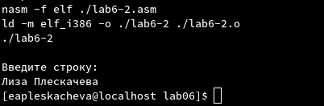

---
## Front matter
title: "Лабораторная работа №6. Основы работы с Midnight Commander (mc).Структура программы на языке ассемблера NASM"
subtitle: "Архитектура ЭВМ"
author: "Плескачева Елизавета Андреевна НММбд-02-22"

## Generic otions
lang: ru-RU
toc-title: "Содержание"

## Bibliography
bibliography: bib/cite.bib
csl: pandoc/csl/gost-r-7-0-5-2008-numeric.csl

## Pdf output format
toc: true # Table of contents
toc-depth: 2
lof: true # List of figures
lot: true # List of tables
fontsize: 12pt
linestretch: 1.5
papersize: a4
documentclass: scrreprt
## I18n polyglossia
polyglossia-lang:
  name: russian
  options:
	- spelling=modern
	- babelshorthands=true
polyglossia-otherlangs:
  name: english
## I18n babel
babel-lang: russian
babel-otherlangs: english
## Fonts
mainfont: PT Serif
romanfont: PT Serif
sansfont: PT Sans
monofont: PT Mono
mainfontoptions: Ligatures=TeX
romanfontoptions: Ligatures=TeX
sansfontoptions: Ligatures=TeX,Scale=MatchLowercase
monofontoptions: Scale=MatchLowercase,Scale=0.9
## Biblatex
biblatex: true
biblio-style: "gost-numeric"
biblatexoptions:
  - parentracker=true
  - backend=biber
  - hyperref=auto
  - language=auto
  - autolang=other*
  - citestyle=gost-numeric
## Pandoc-crossref LaTeX customization
figureTitle: "Рис."
tableTitle: "Таблица"
listingTitle: "Листинг"
lofTitle: "Список иллюстраций"
lotTitle: "Список таблиц"
lolTitle: "Листинги"
## Misc options
indent: true
header-includes:
  - \usepackage{indentfirst}
  - \usepackage{float} # keep figures where there are in the text
  - \floatplacement{figure}{H} # keep figures where there are in the text
---

# Цель работы

Приобретение практических навыков работы в Midnight Commander. 
Освоение инструкций языка ассемблера mov и int.

# Выполнение лабораторной работы

Откроем терминал и введем mc, что бы запустить Midnight Commander.

{ #fig:001 width=70% }

Создадим папку lab06, нажав F7

{ #fig:002 width=70% }

Создадим файл lab06-1.asm с помощью строки ввода

{ #fig:003 width=70% }

Файл появился в MC

{ #fig:004 width=70% }

Откроем этот файл, нажав F4

{ #fig:005 width=70% }

Введем в файл код из листинга 6.1

{ #fig:006 width=70% }

Сохраним файл

{ #fig:007 width=70% }

Откроем сохраненный файл через MC, нажав F3

{ #fig:008 width=70% }

Текст файла  сохранился

Выйдем из MC, нажав F10

Создадим исполняемый файл и запустим его:

{ #fig:009 width=70% }

## Подключение внешнего файла 

Откроем папку Downloads через MC

{ #fig:010 width=70% }

Скопируем файл in_out.asm в lab06

{ #fig:011 width=70% }

Скопируем файл  lab6-1.asm в lab6-2.asm

{ #fig:012 width=70% }

Как видим, оба файла появились в папке lab06

{ #fig:013 width=70% }

Введем файл из листинга 6.2 в lab6-2.asm

{ #fig:014 width=70% }

Создадим исполняемый файл и запустим

{ #fig:015 width=70% }

Мы ввели свое ФИО и программа завершилась.

Если б мы написали вместо sprint, sprintLF, то после сообщения "Введите строку" был бы еще и перенос строки.

# Задания для самостоятельной работы

## Задание 1

Напишем прогармму, которая будет выводить на экран ввденное сообщение, без использования in_out.asm

{ #fig:016 width=70% }

Запустим ее.

{ #fig:017 width=70% }

## Задание 2

Напишем такую же программу, используя in_out.asm 

{ #fig:018 width=70% }

Скомпилируем и запустим программу

{ #fig:019 width=70% }

Как видим, вывод происходит с переносами строки, так как мы используем sprintLF, а не sprint

# Выводы

Мы приобрели практические навыки в работе с Midnight Commander и освоили инструкции mov и int языка ассемблера NASM 
