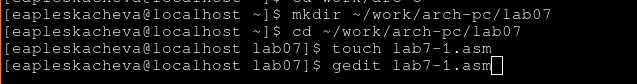

---
## Front matter
title: "Лабораторная работа №7.Арифметические"
subtitle: "Архитектура ЭВМ"
author: "Плескачева Елизавета Андреевна"

## Generic otions
lang: ru-RU
toc-title: "Содержание"

## Bibliography
bibliography: bib/cite.bib
csl: pandoc/csl/gost-r-7-0-5-2008-numeric.csl

## Pdf output format
toc: true # Table of contents
toc-depth: 2
lof: true # List of figures
lot: true # List of tables
fontsize: 12pt
linestretch: 1.5
papersize: a4
documentclass: scrreprt
## I18n polyglossia
polyglossia-lang:
  name: russian
  options:
	- spelling=modern
	- babelshorthands=true
polyglossia-otherlangs:
  name: english
## I18n babel
babel-lang: russian
babel-otherlangs: english
## Fonts
mainfont: PT Serif
romanfont: PT Serif
sansfont: PT Sans
monofont: PT Mono
mainfontoptions: Ligatures=TeX
romanfontoptions: Ligatures=TeX
sansfontoptions: Ligatures=TeX,Scale=MatchLowercase
monofontoptions: Scale=MatchLowercase,Scale=0.9
## Biblatex
biblatex: true
biblio-style: "gost-numeric"
biblatexoptions:
  - parentracker=true
  - backend=biber
  - hyperref=auto
  - language=auto
  - autolang=other*
  - citestyle=gost-numeric
## Pandoc-crossref LaTeX customization
figureTitle: "Рис."
tableTitle: "Таблица"
listingTitle: "Листинг"
lofTitle: "Список иллюстраций"
lotTitle: "Список таблиц"
lolTitle: "Листинги"
## Misc options
indent: true
header-includes:
  - \usepackage{indentfirst}
  - \usepackage{float} # keep figures where there are in the text
  - \floatplacement{figure}{H} # keep figures where there are in the text
---

# Цель работы

Освоение арифметических инструкций языка ассемблера NASM.

# Выполнение лабораторной работы

Создадим папку, перейдем внее и создадим файлы

{ #fig:001 width=70% }

Введем текст из листинга 7.1 в файл

{ #fig:002 width=70% }

Cоздадим исполняемый файл и запустим

{ #fig:003 width=70% }

Программа вывела `j` так как мы складывали символы

# Замена символов на числа

Уберем кавычки

{ #fig:004 width=70% }

Снова скомпилируем и запустим программу

{ #fig:005 width=70% }

Теперь на экран вывелся перенос строки (его символ 10)

## Вывод на экран значения eax

Создадим файл lab7-2.asm и откроем его в gedit. 
Введем код из листинга 7.2

{ #fig:006 width=70% }

Скомпилируем код и запустим его

{ #fig:007 width=70% }

На экран вывелся код символа j

Теперь снова уберем из кода кавычки

{ #fig:008 width=70% }

Запустим измененную программу

{ #fig:009 width=70% }

Теперь программа выводит просто сумму чисел 6+4 = 10

## Замена iprintLf на iprint

Заменим функцию iprintLF на iprint

Запустим теперь программу

{ #fig:010 width=70% }

Теперь 10 вывелось с переносом строки, из-за того, что мы изменили функцию

## Программа на выполнение арифмитической операции

Создадим файл lab7-3.asm и введем в него код из листинга 7.3

{ #fig:011 width=70% }

Скомпилируем программу и запустим ее

{ #fig:012 width=70% }

На экран выводится целая часть и остаток от деления выражения (5*2 + 3)/3

## Программа вычисляющая `(4*6 + 2/5)`

Изменим код программы так, что бы она вычисляла значение выражения `(4*6 + 2)/5)`

{ #fig:0121 width=70% }

{ #fig:0122 width=70% }

## ПРограмма для вывода варианта

Создадим файл variant.asm и введем в него код из листинга 7.4

{ #fig:013 width=70% }

{ #fig:014 width=70% }

Скомпилируем и запустим программу. Введем туда свой студенческий билет.

{ #fig:015 width=70% }

Программа вывела вариант: 2

### Ответы на вопросы

1. За вывод на экран "Ваш вариант" отвечают стоки 31-32

2. инструкции на строка 19-21  используется для ввода числа из консоли  в переменную `x`

3. `call atoi` используется для преобразования ACII кода в число 

4. За вычисление варианта отвечают строки 26-29 

5. Остаток от деления записывается в `edx`

6.  `inc edx` увеличивает значение `edx` на 1

7.  За вывод результата вычислений отвечают строки 33-34

# Задание для самостоятельной работы 

Мой вариант, 2, поэтому надо написать программу вычисляющую значение `(12x + 3)*5`

Изменим программу выше, подставив вместо вычислений варианта по студенческому билету, вычисление функции

{ #fig:016 width=70% }

Скомпилируем и запустим программу. Введем значения x = 1 и x = 6

{ #fig:017 width=70% }

Прогармма вычисляет правильно

# Выводы

Мы освоили арифметические операции на языке ассемблера NASM и написали программу, вычсичляющую значение функции 

# Список литературы{.unnumbered}

::: {#refs}
:::
