---
## Front matter
title: "Лабораторная работа №8. Команды безусловного и условного переходов"
subtitle: "Архитектура ЭВМ"
author: "Плескачева Елизавета Андреевна"

## Generic otions
lang: ru-RU
toc-title: "Содержание"

## Bibliography
bibliography: bib/cite.bib
csl: pandoc/csl/gost-r-7-0-5-2008-numeric.csl

## Pdf output format
toc: true # Table of contents
toc-depth: 2
lof: true # List of figures
lot: true # List of tables
fontsize: 12pt
linestretch: 1.5
papersize: a4
documentclass: scrreprt
## I18n polyglossia
polyglossia-lang:
  name: russian
  options:
	- spelling=modern
	- babelshorthands=true
polyglossia-otherlangs:
  name: english
## I18n babel
babel-lang: russian
babel-otherlangs: english
## Fonts
mainfont: PT Serif
romanfont: PT Serif
sansfont: PT Sans
monofont: PT Mono
mainfontoptions: Ligatures=TeX
romanfontoptions: Ligatures=TeX
sansfontoptions: Ligatures=TeX,Scale=MatchLowercase
monofontoptions: Scale=MatchLowercase,Scale=0.9
## Biblatex
biblatex: true
biblio-style: "gost-numeric"
biblatexoptions:
  - parentracker=true
  - backend=biber
  - hyperref=auto
  - language=auto
  - autolang=other*
  - citestyle=gost-numeric
## Pandoc-crossref LaTeX customization
figureTitle: "Рис."
tableTitle: "Таблица"
listingTitle: "Листинг"
lofTitle: "Список иллюстраций"
lotTitle: "Список таблиц"
lolTitle: "Листинги"
## Misc options
indent: true
header-includes:
  - \usepackage{indentfirst}
  - \usepackage{float} # keep figures where there are in the text
  - \floatplacement{figure}{H} # keep figures where there are in the text
---

# Цель работы
# Выполнение лабораторной работы

## Реализация переходов в NASM

Создадим папку и перейдем в нее. 

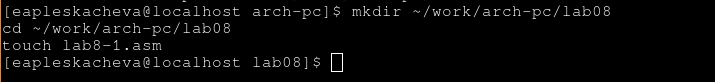{ #fig:001 width=70% }

Введем в lab8-1.asm текст из листинга 8.1
 
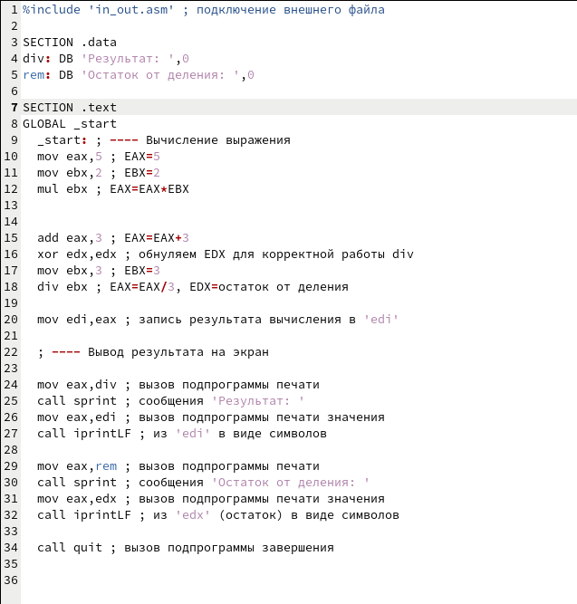{ #fig:002 width=70% }

Скомпилируем и запустим программу
 
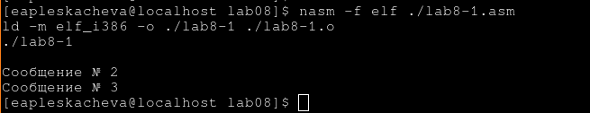{ #fig:003 width=70% }
 
Прогармма вывела сообщение 2 и 3 

Изменим программу так, что бы она выводила сообщения 2 и 1

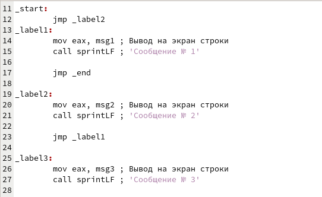{ #fig:004 width=70% }

Запустим измененную программу
 
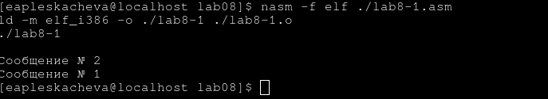{ #fig:005 width=70% }
 
Прогармма вывела вначале 2 потом 1

Теперь изменим программу так, что бы она выводила сообщения 3 2 1

Для этого в самом начале прогармма переносится на вывод сообщения 3, из сообщения 3 к сообщению 2 оттуда к сообщению 1, а сообщение 1 переносит нас на выход

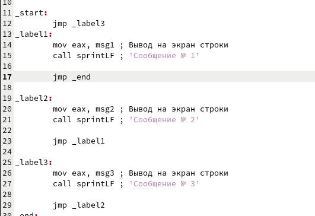{ #fig:006 width=70% }
 
Запустим программу

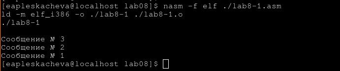{ #fig:007 width=70% }

Программа выводит сообщения в обратном порядке

## Программа выводящая наибольшее число
 
Скопируем код из листинга 8.3 в lab8-2.asm

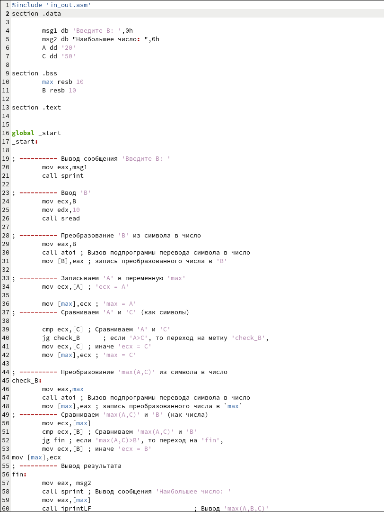{ #fig:008 width=70% }

Запустим программу
 
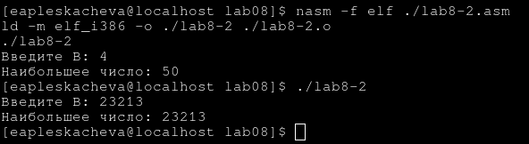{ #fig:009 width=70% }
 
Программа верно выводит наибольшие числа

## Изучение листинга

Создадим листинг программы lab8-2.asm

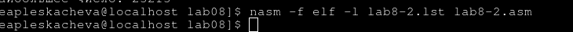{ #fig:010 width=70% }

Откроем файл листинга в gedit
 
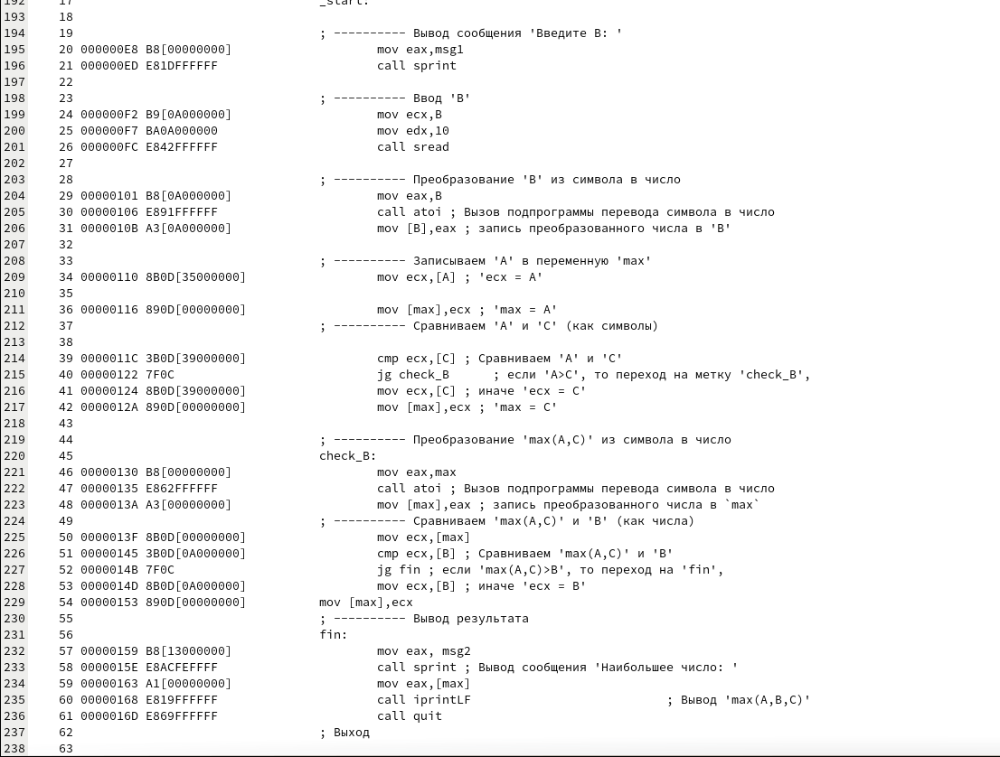{ #fig:011 width=70% }
 
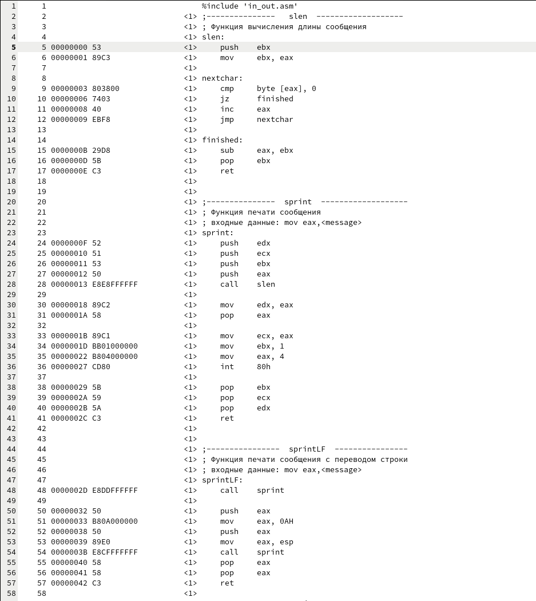{ #fig:012 width=70% }
 
### Объяснение содержимого файлов листинга

1. На первой строчке находится подключение внешнего файла. Дальше в листинге содержится все содержимое внешнего файла.

2.Наша программа начинается со 192 строчки, там находится _start

3. Uа сьолчке 201 находится вызов функции sread, справа написан номер строки в файле,адрес в памяти и код комманды

### Cоздадим ошибку в программе

На 57 строчке уберем один регистр

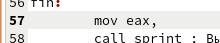{ #fig:013 width=70% }
 
Теперь создадим листинг для этой программы. 

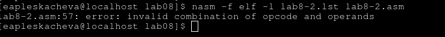{ #fig:014 width=70% }
 
При создании листинга выводится ошибка,но листинг создается

Просмотрим листинг

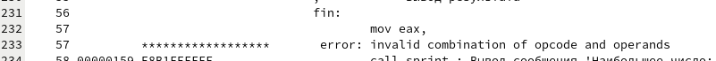{ #fig:015 width=70% }
 
После строчки, на которой мы сделали ошибку появляется сообщение об ошибке

# Задание для самостоятельной работы 

## Программа, находящая наименьшее

Напишем программу, которая будет выводить наименьшее число из чисел 82 59 61 (потому что мой вариант 2)

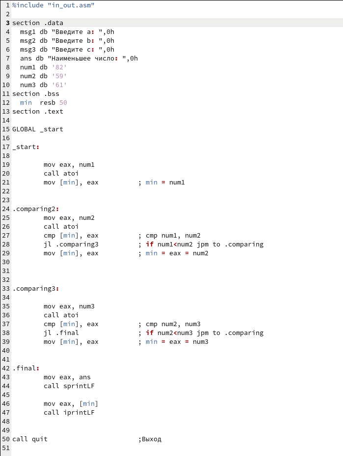{ #fig:016 width=70% }

Скомпилируем и запустим ее
 
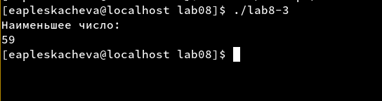{ #fig:017 width=70% }

Программа верно вывела наименьшее число 59

# Программа, вычисляющая значение функции

Напишем программу которая будет вчислять функцию:

a - 1, если x< a
x - 1, если x >= a

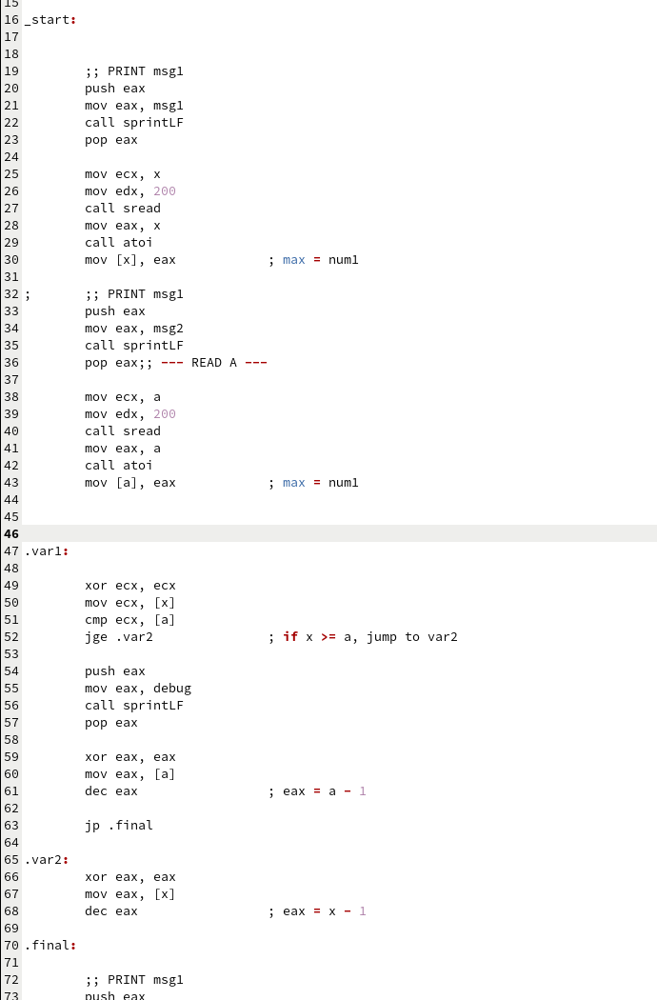{ #fig:019 width=70% }

Скомпилируем ее и запустим. Проверим на значениях (5;7) и (6;4)
 
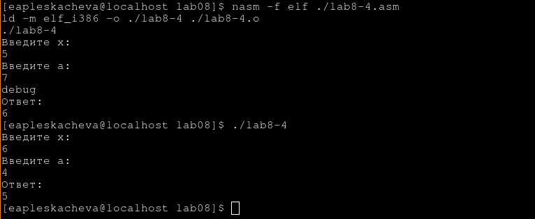{ #fig:018 width=70% }
 
Прогармма вычисляет функцию верно.
 

# Выводы

Мы изучили условные переходы в языке Ассемблера NASM и научились писать программы с их использованием и  ознакомились со структурой файлов листинга.
