---
## Front matter
title: "Лабораторная работа №9. Программирование цикла. Обработка"
subtitle: "Дисциплина: Архитектура ЭВМ"
author: "Плескачева Елизавета Андреевна"

## Generic otions
lang: ru-RU
toc-title: "Содержание"

## Bibliography
bibliography: bib/cite.bib
csl: pandoc/csl/gost-r-7-0-5-2008-numeric.csl

## Pdf output format
toc: true # Table of contents
toc-depth: 2
lof: true # List of figures
lot: true # List of tables
fontsize: 12pt
linestretch: 1.5
papersize: a4
documentclass: scrreprt
## I18n polyglossia
polyglossia-lang:
  name: russian
  options:
	- spelling=modern
	- babelshorthands=true
polyglossia-otherlangs:
  name: english
## I18n babel
babel-lang: russian
babel-otherlangs: english
## Fonts
mainfont: PT Serif
romanfont: PT Serif
sansfont: PT Sans
monofont: PT Mono
mainfontoptions: Ligatures=TeX
romanfontoptions: Ligatures=TeX
sansfontoptions: Ligatures=TeX,Scale=MatchLowercase
monofontoptions: Scale=MatchLowercase,Scale=0.9
## Biblatex
biblatex: true
biblio-style: "gost-numeric"
biblatexoptions:
  - parentracker=true
  - backend=biber
  - hyperref=auto
  - language=auto
  - autolang=other*
  - citestyle=gost-numeric
## Pandoc-crossref LaTeX customization
figureTitle: "Рис."
tableTitle: "Таблица"
listingTitle: "Листинг"
lofTitle: "Список иллюстраций"
lotTitle: "Список таблиц"
lolTitle: "Листинги"
## Misc options
indent: true
header-includes:
  - \usepackage{indentfirst}
  - \usepackage{float} # keep figures where there are in the text
  - \floatplacement{figure}{H} # keep figures where there are in the text
---

# Цель работы

Приобретение навыков написания программ с использованием циклов и обработка аргументов коммандной строки.

# Выполнение лабораторной работы

## Реализация циклов

Создадим каталог для выполнения лабораторной, перейдем в него 

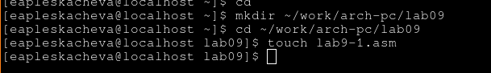{ #fig:001 width=70% }

введем листинг 9.1 в файл

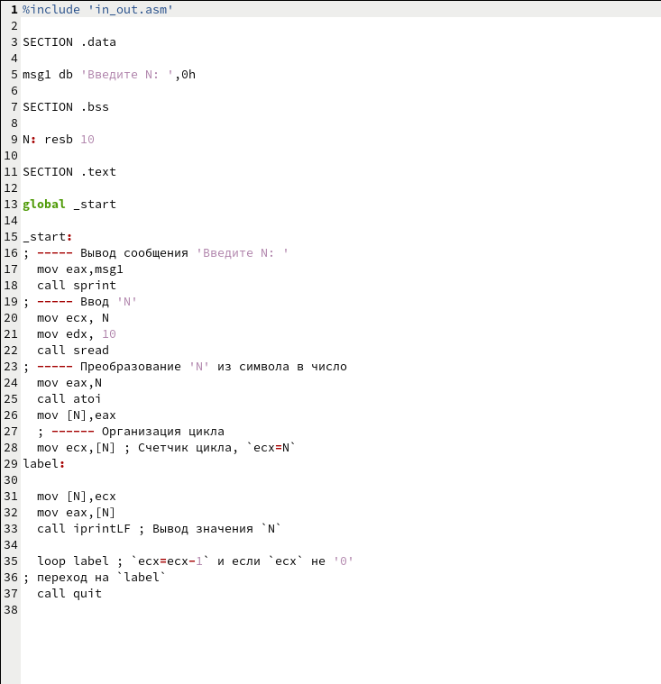{ #fig:002 width=70% }

Скомпилируем и запустим код. Проверим его. 

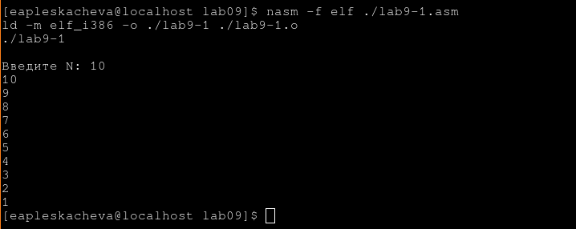{ #fig:003 width=70% }

Программа выводит числа от 10 до 1

Добавим строчку `sub ecx, 1` в программу

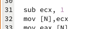{ #fig:004 width=70% }

Скомпилируем и запустим.

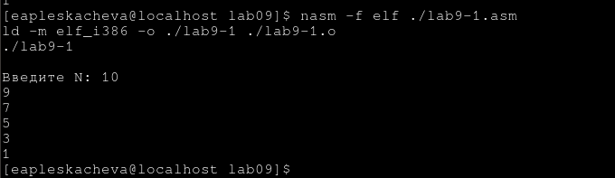{ #fig:005 width=70% }

Теперь программа выводит числа 9 7 5 3 1

ЧТо бы программа работала как раньше, но начинала с 9, обернем код в push pop

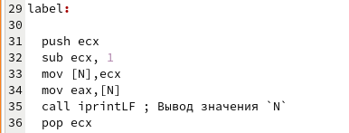{ #fig:006 width=70% }

Скомпилируем и запустим

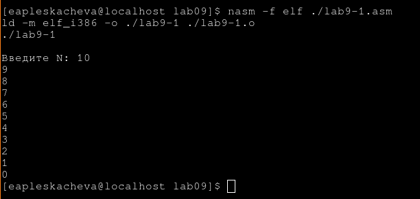{ #fig:007 width=70% }

Теперь программа выводит числа от 9 до 0

## Обработка аргументов коммандной строки

Введем в lab9-2.asm листинг 9.2

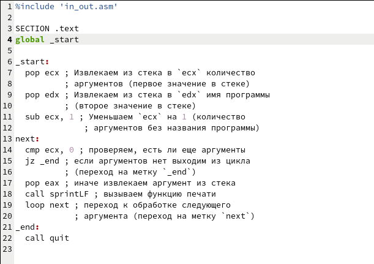{ #fig:008 width=70% }

Скомпилируем и запустим програму указав аргументы

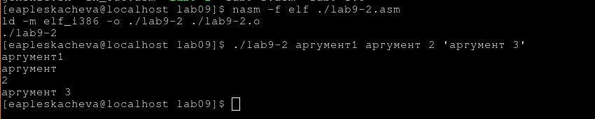{ #fig:009 width=70% }

Программа Выводит аргументы последовательно на экран.
Программа выводит 4 аргумента

### Выведение суммы аргументов

Введем код из листинга 9.3 в lab9-3, скомпилируем и запустим его

Введем аргументы 12 13 7 10 5

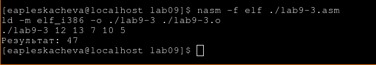{ #fig:010 width=70% }

Программа вывела сумму аргументов - 47

### Выведение произведения аргументов

Изменим программу  lab9-3.asm так, что бы она умножала аргументы.
Сохраним измененную прогармму в lab9-3-mult.asm

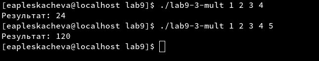{ #fig:014 width=70% }

Скомпилируем и запустим программу, проверим ее на несокльких аргументах

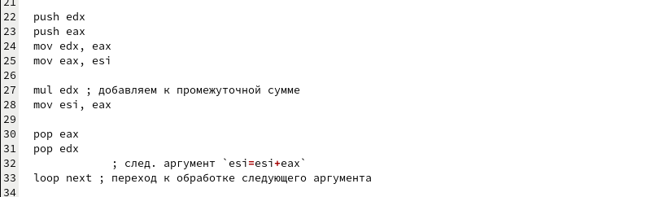{ #fig:013 width=70% }

Программа выводит правильный результат 

# Задания для самостоятельной работы

Мой вариант - 2, поэтому пишем программу, которая выводит сумму результатов функции `f(x) = 3x - 1`

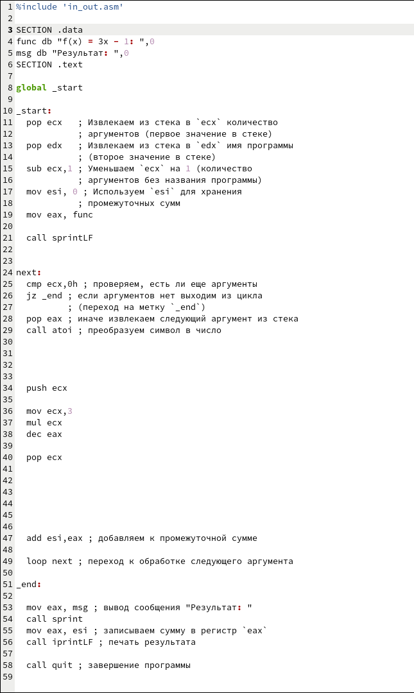{ #fig:011 width=70% }

Запустим программу и проверим ее на аргументах 1 2 3 4

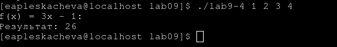{ #fig:012 width=70% }

Результат верный

# Выводы

Мы приобрели навыки написания программ с использованием циклов и научились обрабатывать агументы коммандной строки.
