---
## Front matter
title: "Лабораторная работа №10. Понятие подпрограммы. Отладчик GDB."
subtitle: "Дисциплина: Архитектура ЭВМ"
author: "Плескачева Елизавета Андреевна"

## Generic otions
lang: ru-RU
toc-title: "Содержание"

## Bibliography
bibliography: bib/cite.bib
csl: pandoc/csl/gost-r-7-0-5-2008-numeric.csl

## Pdf output format
toc: true # Table of contents
toc-depth: 2
lof: true # List of figures
lot: true # List of tables
fontsize: 12pt
linestretch: 1.5
papersize: a4
documentclass: scrreprt
## I18n polyglossia
polyglossia-lang:
  name: russian
  options:
	- spelling=modern
	- babelshorthands=true
polyglossia-otherlangs:
  name: english
## I18n babel
babel-lang: russian
babel-otherlangs: english
## Fonts
mainfont: PT Serif
romanfont: PT Serif
sansfont: PT Sans
monofont: PT Mono
mainfontoptions: Ligatures=TeX
romanfontoptions: Ligatures=TeX
sansfontoptions: Ligatures=TeX,Scale=MatchLowercase
monofontoptions: Scale=MatchLowercase,Scale=0.9
## Biblatex
biblatex: true
biblio-style: "gost-numeric"
biblatexoptions:
  - parentracker=true
  - backend=biber
  - hyperref=auto
  - language=auto
  - autolang=other*
  - citestyle=gost-numeric
## Pandoc-crossref LaTeX customization
figureTitle: "Рис."
tableTitle: "Таблица"
listingTitle: "Листинг"
lofTitle: "Список иллюстраций"
lotTitle: "Список таблиц"
lolTitle: "Листинги"
## Misc options
indent: true
header-includes:
  - \usepackage{indentfirst}
  - \usepackage{float} # keep figures where there are in the text
  - \floatplacement{figure}{H} # keep figures where there are in the text
---

# Цель работы
Приобретение навыков написания программ с использованием подпрограмм.
Знакомство с методами отладки при помощи GDB и его основными возможностями
# Выполнение лабораторной работы

Создадим каталог и файл для выполнения лабораторной работы

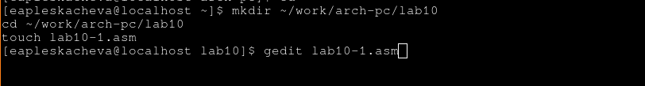{ #fig:001 width=70% }

Введем листинг 10.1 в lab10-1.asm

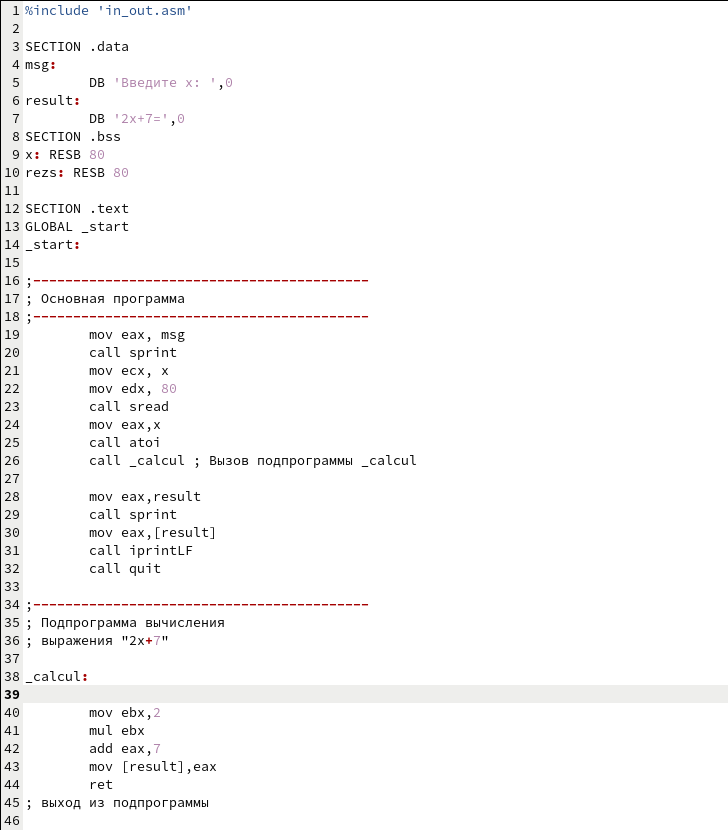{ #fig:002 width=70% }

Скомпилируем и запустим программу. 

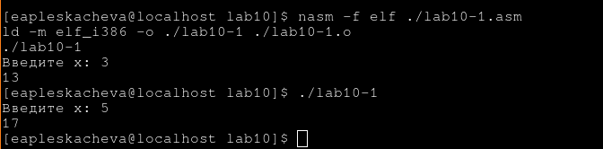{ #fig:003 width=70% }

Программа выводит 13 и 7 для 3 и 5, потому что функция 2x + 7

## Создание подпрограммы

Создадим подпрограмму, которая будет вычислять g(x) = 3x - 1

Добавим ее вниз нашего кода и в вычисления

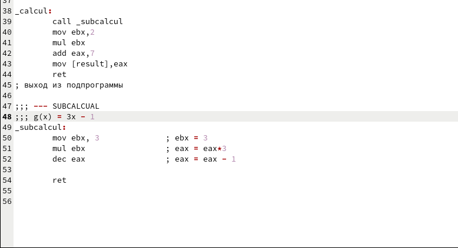{ #fig:004 width=70% }

Снова запустим и посмотрим, как изменился результат 

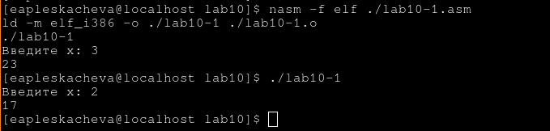{ #fig:005 width=70% }

f(g(x)) = 2(3x - 1) + 7 = 6x + 5
f(g(3)) = 18 + 5 = 23
f(g(2)) = 12 + 5 = 17 

Результат верный

## Отладка с помощью GDB

Скопируем листинг 10.2 в  `lab10-2.asm`, скомпилируем и запустим программу.

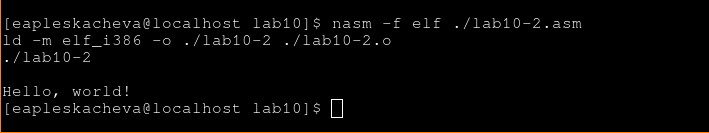{ #fig:006 width=70% }

Программа выводит на экран сообщение

Теперь создадим листинг для lab10-2 и откроем исполняемый файл через GDB

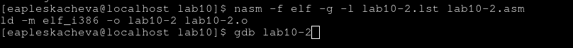{ #fig:007 width=70% }

Открыв программу в gdb запустим ее, написав `run`

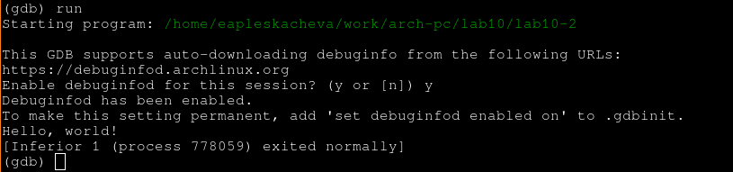{ #fig:008 width=70% }

Поставим точку остановки на `_start` и запустим программу

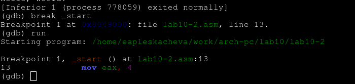{ #fig:009 width=70% }

Теперь програмаа запустилась, но остановилась на `_start`

### ПРосмотр дизасемблированного кода 

Напишем `dissassemble _start` что бы посомотреть дизассемблированный код

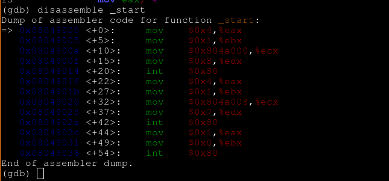{ #fig:010 width=70% }

Изменим отображение на intel 

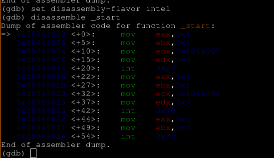{ #fig:011 width=70% }

Теперь программа выглядит как на NASM

### Режим псевдографики

Напишем `layout asm` `layout regs` и `run` что бы включить режим псевдографики и запустить прогроамм

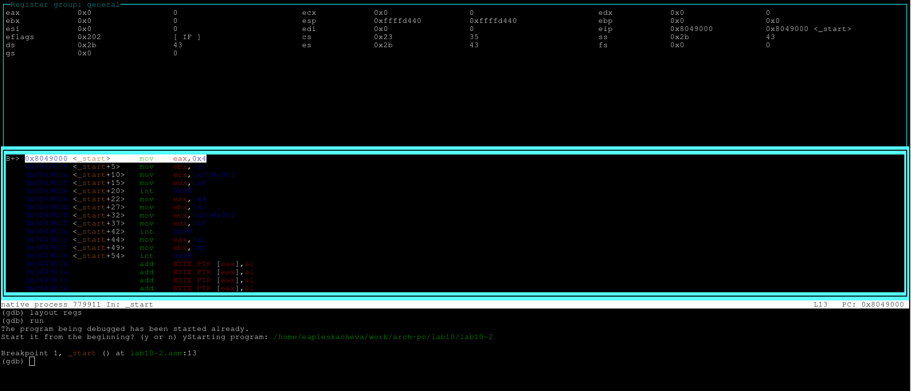{ #fig:012 width=70% }

### Информация о точках остановки

Просмотрим информацию о поставленных точках остановки, написав `i b`

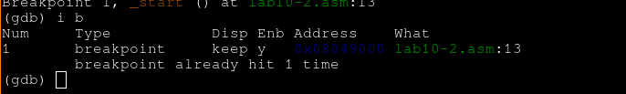{ #fig:013 width=70% }

Поставим точку остановки на `0x8049031` 

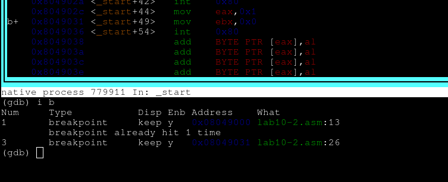{ #fig:014 width=70% }

Просмотрим информацию о точках остановки и увидим там новую точку

### Работа с данными программы

Вывведем содеримое переменной `msg1`

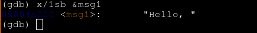{ #fig:015 width=70% }

Выведем содержимое `msg2` по адресу 

{ #fig:016 width=70% }

### Изменение данных в памяти

Заменим "H" на "h" в msg1

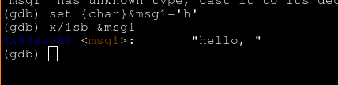{ #fig:017 width=70% }

Изменим любой символ в msg2

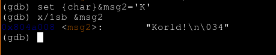{ #fig:018 width=70% }

### Изменение содержимого регистра

Изменим значение ebx на '2' и на 2

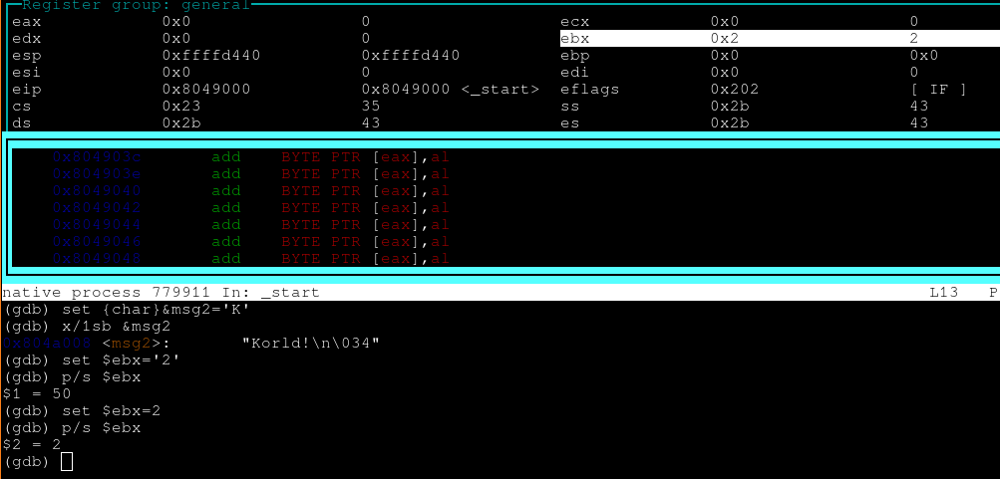{ #fig:019 width=70% }

В начале программа выводит код символа 2, а потом число 2

Продолжим исполнение программы и завершим ее

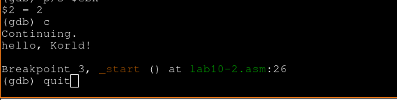{ #fig:020 width=70% }

Заметим, что выводимое сообщенеи изменилось

## Обработка аргументов коммандной строки

Скопируем lab9-2.asm в lab10-3.asm создадим исполняемый файл с отладочной информацией и откроем программу через gdb добавив аргументы.

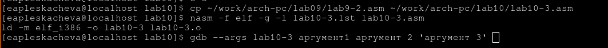{ #fig:021 width=70% }

Поставим точку остановы на _start и запустим прогармму

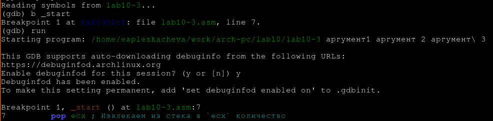{ #fig:022 width=70% }

Выведем значене esp

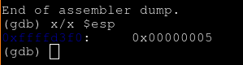{ #fig:023 width=70% }

В esp лежит 5, потому что аргументов 5

Просмотрим остальное содержиме стека

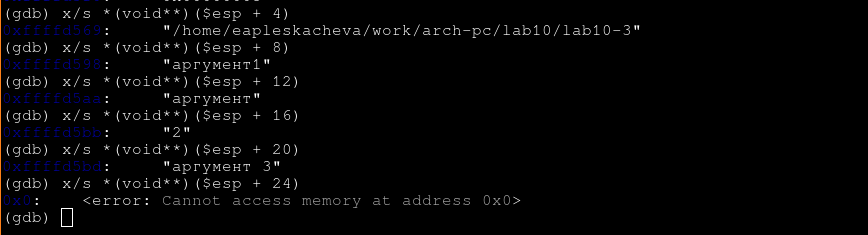{ #fig:024 width=70% }

Мы увеличиваем, значение адресса на 4 потому что столько занимет размер указателя на аргумент из стека.

Продолжим программу и завершим ее

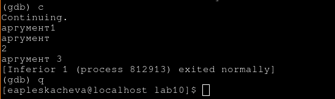{ #fig:025 width=70% }

# Задания для самостоятельной рабоыт

## Написание подпрограммы

Изменим программу из  самостоятельно лабораторной 9, представив функцию как подпрограмму. 

Напишем эту программу в низу кода 

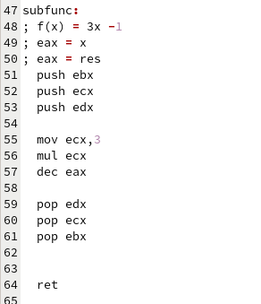{ #fig:026 width=70% }

Запустим и проверим правильность программы 

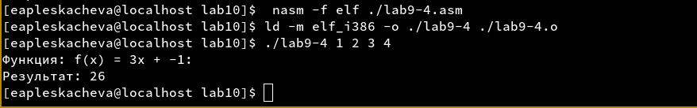{ #fig:027 width=70% }

Результат верный 

## Поиск ошибки в программа через GDB

Введем в lab10-4.asm код из листинга 10.3, скомпилируем его и запустим через GDB

Так как происходит умножение, то после исполнения mul в eax должен оказаться результат вычислени.
Там должно лежать `(3+2)*4 = 20`

Пройдемся до исполнения этой части программы

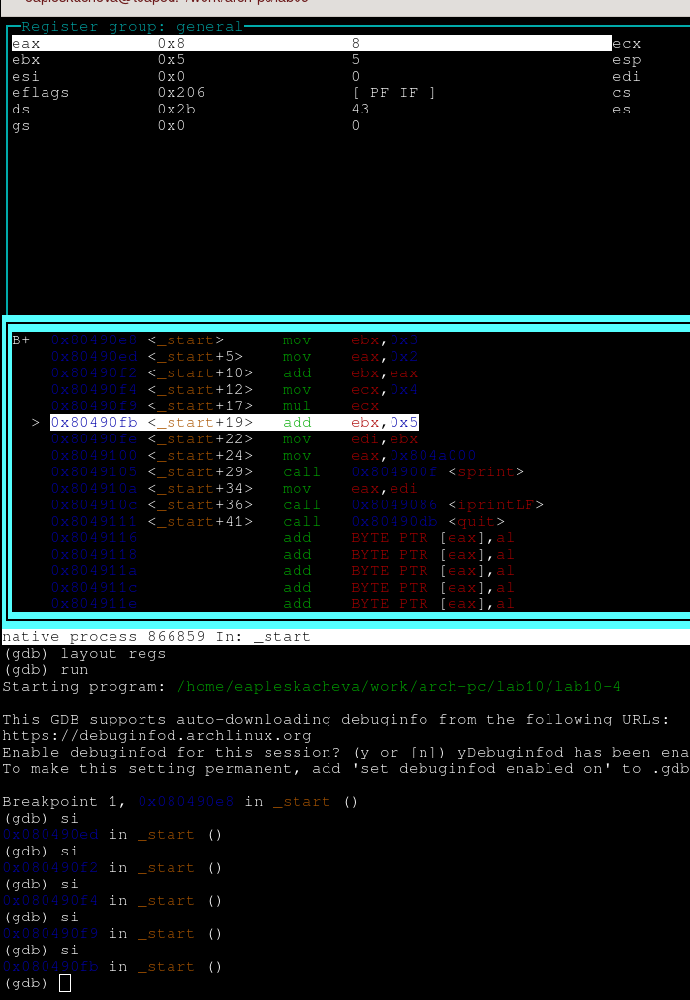{ #fig:028 width=70% }

После исполнения умножения в eax лежит 8. Это потому что мы умножаем eax на ecx, а сложение производилось в ebx

Изменим код так, что бы программа работала верно

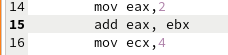{ #fig:029 width=70% }

Теперь суммирование будет в eax

Снова запустим GDB и дойдем до того же момента.

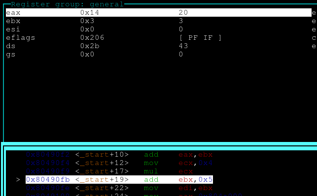{ #fig:030 width=70% }

Теперь в eax лежит 20

Будем просматривать прогармум дальше 

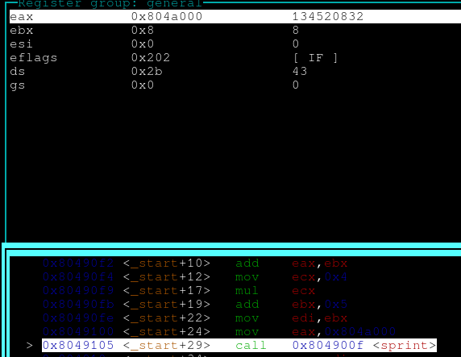{ #fig:031 width=70% }

Заметим, что в eax записывается сообщение для вывода, а само значение никуда не сохраняется, а так же 5 прибавляется к ebx, в котором до этого лежало 3, поэтому теперь там 8

Изменим програму так что бы она работала корректно

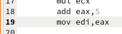{ #fig:032 width=70% }

Запустим программу теперь и понаблюдаем за ее исполнением 

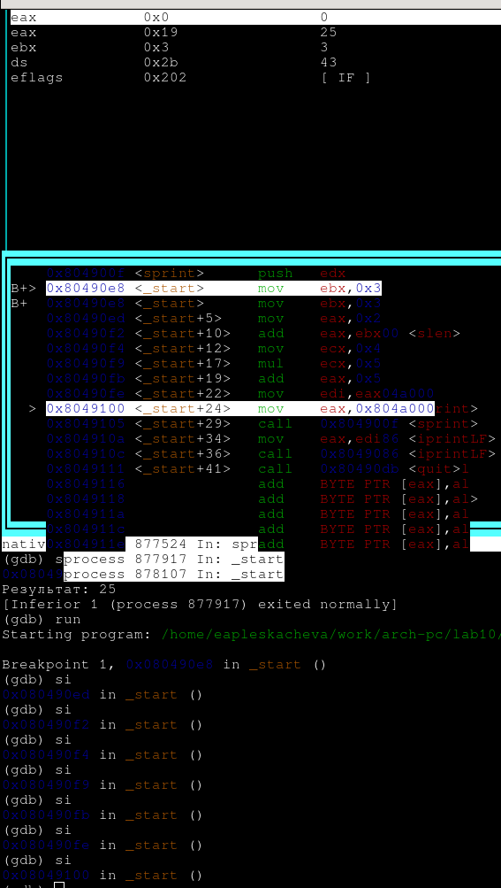{ #fig:033 width=70% }

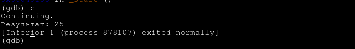{ #fig:034 width=70% }

Теперь программа вычисляет значение правильно, на этом ее можно завершить

# Выводы
Мы приобрели навыки написания программ с использованием подпрограмм и  ознакомились с процессом отладки через программу GDB и научились пользоваться его основными возможностями.

