---
## Front matter
title: "Работа с файлами средствами Nasm"
subtitle: "Отчёт по лабораторной работе №11"
author: "Плескачева Елизавета Андреевна"

## Generic otions
lang: ru-RU
toc-title: "Содержание"

## Bibliography
bibliography: bib/cite.bib
csl: pandoc/csl/gost-r-7-0-5-2008-numeric.csl

## Pdf output format
toc: true # Table of contents
toc-depth: 2
lof: true # List of figures
lot: true # List of tables
fontsize: 12pt
linestretch: 1.5
papersize: a4
documentclass: scrreprt
## I18n polyglossia
polyglossia-lang:
  name: russian
  options:
	- spelling=modern
	- babelshorthands=true
polyglossia-otherlangs:
  name: english
## I18n babel
babel-lang: russian
babel-otherlangs: english
## Fonts
mainfont: PT Serif
romanfont: PT Serif
sansfont: PT Sans
monofont: PT Mono
mainfontoptions: Ligatures=TeX
romanfontoptions: Ligatures=TeX
sansfontoptions: Ligatures=TeX,Scale=MatchLowercase
monofontoptions: Scale=MatchLowercase,Scale=0.9
## Biblatex
biblatex: true
biblio-style: "gost-numeric"
biblatexoptions:
  - parentracker=true
  - backend=biber
  - hyperref=auto
  - language=auto
  - autolang=other*
  - citestyle=gost-numeric
## Pandoc-crossref LaTeX customization
figureTitle: "Рис."
tableTitle: "Таблица"
listingTitle: "Листинг"
lofTitle: "Список иллюстраций"
lotTitle: "Список таблиц"
lolTitle: "Листинги"
## Misc options
indent: true
header-includes:
  - \usepackage{indentfirst}
  - \usepackage{float} # keep figures where there are in the text
  - \floatplacement{figure}{H} # keep figures where there are in the text
---

# Цель работы

Приобретение навыков написания программ для работы с файлами. 

# Выполнение лабораторной работы

Создала каталог для программ лабораторной работы №11, перешла в него и создала файлы lab11-1.asm и readme.txt (рис. [-@fig:001])

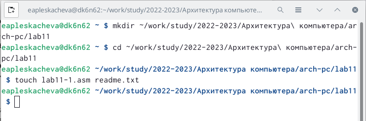{ #fig:001 width=70% }

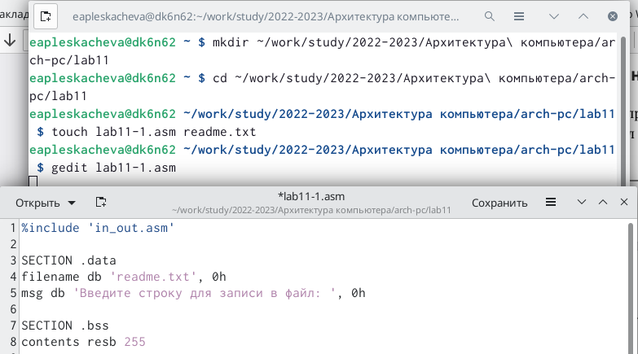{ #fig:002 width=70% }

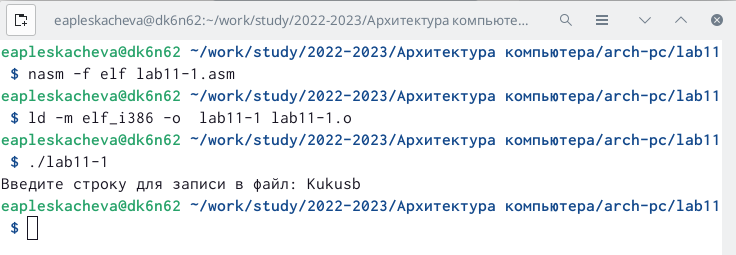{ #fig:003 width=70% }

После работы программы в файле записывается введённый пользователем текст (рис. [-@fig:004])

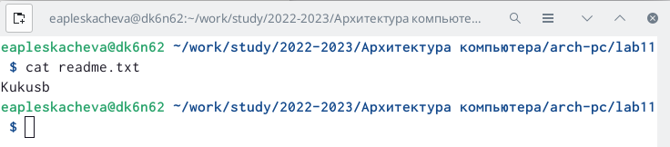{ #fig:004 width=70% }

С помощью команды chmod убрала право на исполение для всех пользователей. С помощью команды ls и ключа -l посмотрела права доступа пользователей к файлу lab11-1 (рис. [-@fig:005])

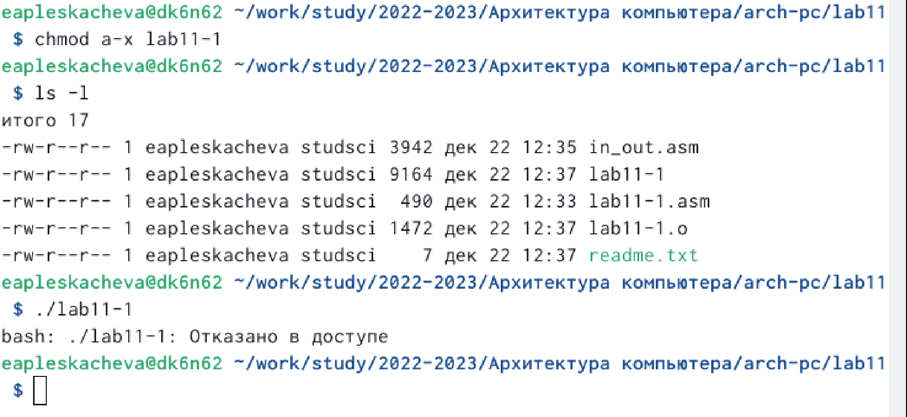{ #fig:005 width=70% }

После попытки выполнить файл высвечивается сообщение "Отказано в доступе" из-за того, что я убрала право на исполнение файла lab11-1.

С помощью команды chmod добавила право на исполение для всех пользователей. С помощью команды ls и ключа -l посмотрела права доступа пользователей к файлу lab11-1.asm (рис. [-@fig:006])

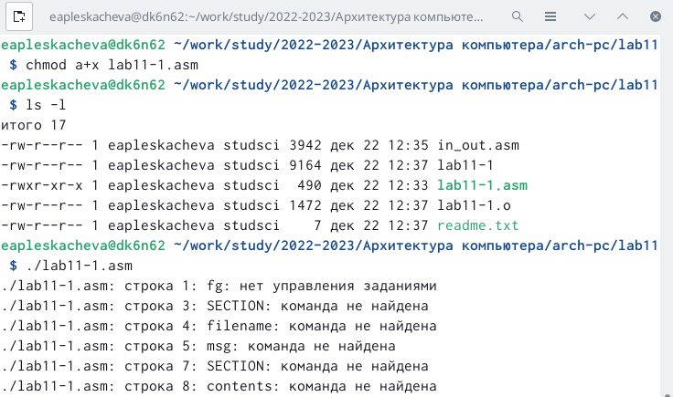{ #fig:006 width=70% }

После запуска файла появляются ошибки, так как файл lab11-1.asm не расчитан на исполнение.

Предоставила права доступа к файлу readme.txt в соответствии со вторым вариантом, полученным в лабораторной работе №7 (рис. [-@fig:007])

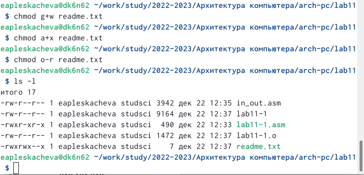{ #fig:007 width=70% }

С помощью команды ls и ключа -l посмотрела права доступа пользователей к файлу lab11-1.asm

# Выполнение самостоятельной работы

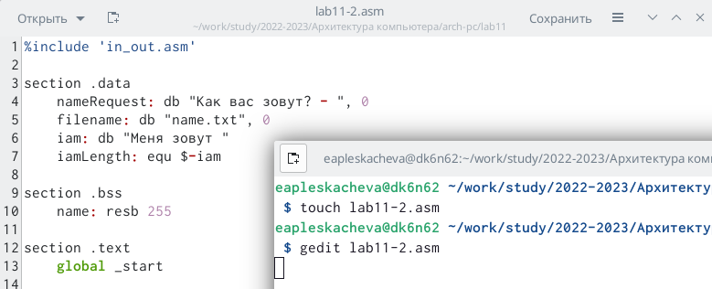{ #fig:008 width=70% }

{ #fig:009 width=70% }

{ #fig:010 width=70% }

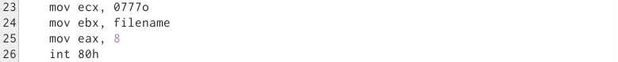{ #fig:011 width=70% }

{ #fig:012 width=70% }

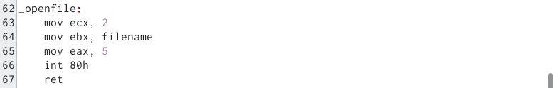{ #fig:013 width=70% }

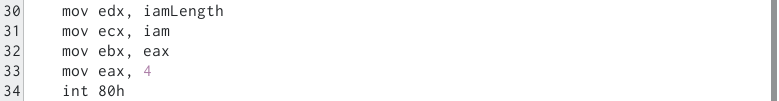{ #fig:014 width=70% }

{ #fig:015 width=70% }

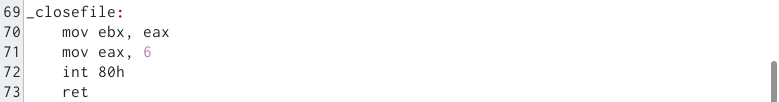{ #fig:016 width=70% }

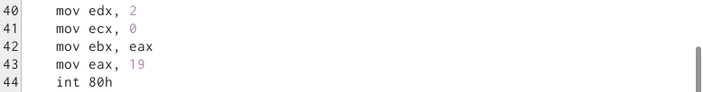{ #fig:017 width=70% }

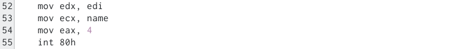{ #fig:018 width=70% }

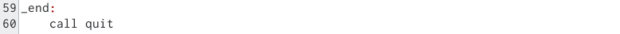{ #fig:019 width=70% }

Создала исполняемый файл и проверила его работу (рис. [-@fig:020])

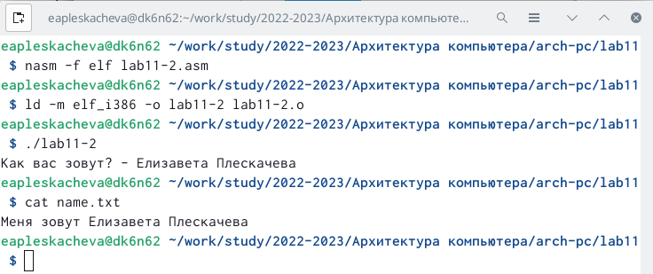{ #fig:020 width=70% }

# Выводы

Приобрела навыки написания программ для работы с файлами.
